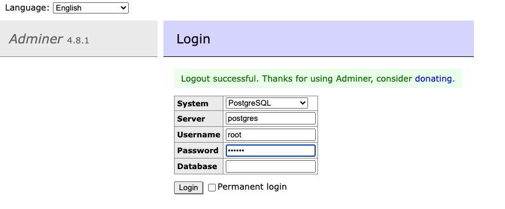

# Gin template

## Prerequisite:

1. Docker
2. Docker-compose
3. Migrate
   - Ubuntu: [Github](https://github.com/golang-migrate/migrate/tree/master/cmd/migrate)
   - MacOS: [Homebrew](https://formulae.brew.sh/formula/golang-migrate)
4. Mockgen: [Github](https://github.com/uber-go/mock)
5. Sqlc: `go install github.com/kyleconroy/sqlc/cmd/sqlc@latest`

## Before start the project

- Name of module is placed in `go.mod`, you need rename it.
- Fix all imports in all files with "re-named" module
- This project use [godotenv](https://github.com/joho/godotenv) for loading configs. The priority of loading is:
  - .env.development.local, .env.test.local, .env.production.local
  - .env.local
  - .env.development, .env.test, .env.production
  - .env
  - Default environment is `.env.development`. If you want to run production mode you must create `.env.production` file then run `make run-prod`
  - Don't forget to check these files to make sure the valid modules and configs:
    - `app.env`
    - `.docker.env`
    - `docker-compose.dev`
    - `docker-compose`
    - `Makefile`
- It uses **sqlc** tool for generating **.go** files at `db/sqlc` directory. It makes easier for interacting with database layer.
  > Just add sql scripts in `db/query` directory, each file corresponding one entity.
- It uses **paseto** for token generation, you can add another token generator that you want, it has an interface named **Maker** at `token/maker.go`

## Project structure

```null
📦 docs                     # Documents 
📦 api                      # Business layer
 ┣ 📜 server.go             # Init routing
 ┗ 📜 [sample].go         # Sample API
 ┣ 📜 middleware.go         # Middleware
 ┗ 📜 validator.go          # Validator for Gin
 ┣ 📜 main_test.go          # Test all apis
📦 db                       # Database layer
 ┣ 📂 initdb                  # Init sql (optional)
 ┃ ┣ 📂 func_proc             # function and procedure for database
 ┃ ┣ 📂 trigger               # trigger for database
 ┃ ┗ 📜 [sample].sql
 ┣ 📂 migration              # Contains migration files
 ┣ 📂 mock                   # Mock db (auto generating)
 ┣ 📂 query                  # Define entities here
 ┃ ┗ 📜 [sample].sql
 ┣ 📂 sqlc                   # Database caller (auto-generating)
 ┃ ┣ 📜 db.go, models.go, querier.go  # (auto-generating)
 ┃ ┣ 📜 [sample].go                   # (auto-generating)
 ┃ ┗ 📜 store.go             # Database storage (tx logics)
 ┣ 📂 token                  # token
 ┣ 📂 utils
 ┣ 📜 main.go                # Init sever and db, start here
 ┣ 📜 .docker.env
 ┣ 📜 .env
 ┗ 📜 .env.development

```

## How to start this project?

1. Install dependencies `make install`
2. Run for the first time (docker-compose.dev.yml): `make bootstrap`
3. Run `make server` to start server
4. Or run `make run-prod` to start server in production mode


## Accessing database
- Access [adminer](http://localhost:8080/) and login follows info in **.docker.env** file.


## Other commands
- Migration up: `make migrateup` (auto run when start server)
- Drop all db: `make migratedown`
- Sql command line: `make psql`

## After added new entities, you must run these commands for re-generating **models**
`make sqlc` and  `make mock`

